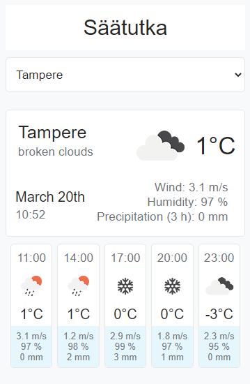
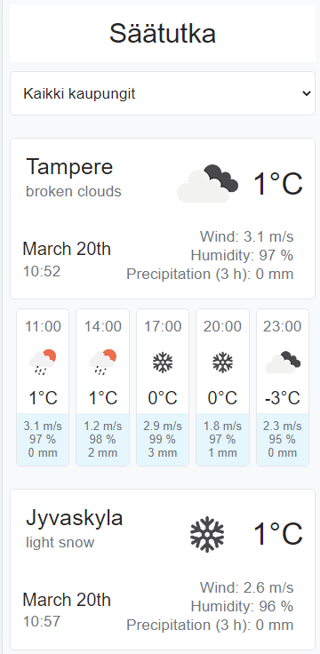

# Weather Radar

## Installation

1. If you don't have an api key yet you can get one [here](https://home.openweathermap.org/)
2. Create a file called ".env" in the root folder of the project.
3. Inside the file put the following:
   REACT_APP_API_KEY = <your api key here>
4. npm install
5. npm start

## Tech

- React
- Typescript

## Screenshots

### One city

### All cities

